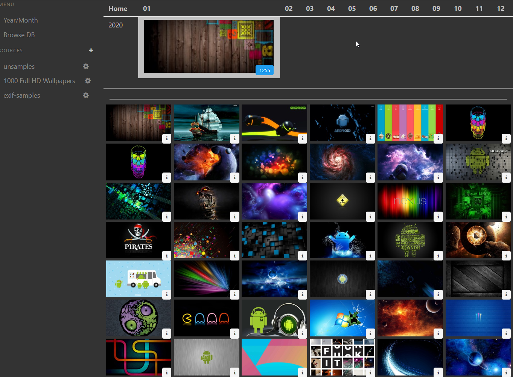
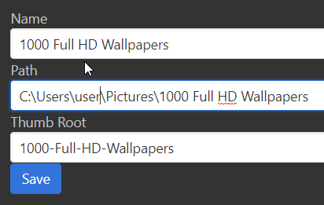

Pinacothèque
===

The web-based image browser for your GB of photos.



Written with PHP with some TypeScript.

As you can see, images are grouped by year/month automatically. After selecting year/month all images in that month are shown. You can click any image to open full-screen preview.

| Note: this is an alternative to [Adobe Bridge CC](https://www.agitraining.com/adobe/creative-cloud-training/what-is-adobe-bridge) or any other image management tool.

Motivation
---

My photo collection spans two decades and contains close to a million photos. I used Picasa (RIP) when it was alive. But the location of my album(s) can change as I make backups and move from one network server to another. With Picasa I needed to rebuild the index (meta information and thumbnail) from time to time and the process took a long time.

I want to have an image browser which stores the thumbnails and meta information in an open format so that I may tweak it's location when my image library moves.

You may have multiple locations where you store images. Each location (image source) has it's own separate thumbnail and meta-data storage location.

Pinacotheque (this app) originally stored thumbnails in a "data" folder (configured in .env). Metadata was stored in the same location in a file called "meta.json". This was not fast enough when having thousands of folders with thousands of photos.

Currently Pinacotheque is storing it's metadata in SQLite database (MySQL is also possible). The thumbnails are still stored as small files in a "data" folder.

It also supports video files, but the focus is on previewing images. [ffmpeg](https://www.ffmpeg.org/) is required to create thumbnails from video. Configure it's path in ```.env```.

Indexing
---

Before you can quickly(!) browse your image collection we need in index all images (slowly).

Usage
---

1. Install dependencies with:

```
> composer install
```

2. Create SQLite or MySQL database.

SQLite location is in ```data/database.sqlite``` by default.
Configure MySQL connection information in ```.env``` file like this.

Create tables as shown in [sql/source.sql](sql/source.sql), [sql/files.sql](sql/files.sql), [sql/meta.sql](sql/meta.sql).

```
DATA_STORAGE=./data
ffmpeg=/Users/user/.sys/ffmpeg
mysql=127.0.0.1
mysql.user=root
mysql.password=123
mysql.db=pina
```

3. Start the server with this command:

```
> composer run serve
```

Or you can use your standard Apache or Nginx web-server. This is faster as simultaneous image downloading is possible).

4. Go to http://localhost:8080/ or your own web-server and create a new Source and provide the path to the image library.



Name: the value for humans to see
Path: the location of original images
Thumb Root: the subfolder name inside "DATA_STORAGE=./data" location for this image library.

5. Start image processing.

```
> php index.php ScanEveryFileFromDB 1
```

Where "1" is the ID of the Source you created in the database.
This process will create a mirror of the folders in the source.path while also creating thumbnails for the images and video files. Thumbnails will be saved in a configured subfolder inside ```DATA_STORAGE``` path.
Metadata will be stored in DB.

While the indexing is running you may already browse the indexed files in the browser. If the indexing is stopped or crashed, you can run it again and it will continue working from the place it stopped.

Controls
---

When in full-screen preview (click any image).

* ArrowLeft/ArrowRight: next/previous image
* ArrowUp/ArrowDown: next/previous image
* PageUp/PageDown: next/previous row of images (+/- 6)
* Home/End: Image #1, last image
* Escape/Enter/click on the image: exit fullscreen mode

Performance optimizations
---
Efforts were made to
1. Only create thumbnails once.
2. Create thumbnails on the fly, if indexing process has not created a thumbnail yet.
3. Enable permanent caching of the downloaded images in the browser.
4. Display thumbnail as a background for the big image while it's loading.
5. Preload 5 previous and 5 next images when watching images fullscreen.
6. When browsing next/previous images in full-screen preview, the URL of the page changes accordingly (even though it's not doing a new page load). This maintains a valid URL for bookmarks or sharing.
7. When in full-screen preview you may navigate to next/previous images, but when exiting preview - the list of thumbnails will scroll to show the last image on screen (highlighted). Browser back button doesn't do that - use Escape/Enter keys.

Some experiments and links
---

* [World-Wide Scale Geotagged Image Dataset for Automatic Image Annotation and Reverse Geotagging](https://www.researchgate.net/publication/259802674_World-Wide_Scale_Geotagged_Image_Dataset_for_Automatic_Image_Annotation_and_Reverse_Geotagging)
* [Alternative using linux tools (find, grep)](https://petermolnar.net/how-to-build-an-exif-database-to-understand-your-photography/)
* [How can I create a map with GPS data from EXIF?](https://photo.stackexchange.com/questions/32420/how-can-i-create-a-map-with-gps-data-from-exif)

ToDo
----

* [x] Scan folders and build thumbnails
* [x] Scan folders and store metadata
* [x] Load all meta information into RAM to do queries
* [ ] Accept HTTP requests to query different things
* [x] Make --React-- (Vanilla JS) app to show images and filter by all metadata
* [x] ScanDir should skip non-image files
* [x] Add scanning Exif data to the database
* [ ] Display a map of all places of the images of the selected month

Later:
* [x] Add editing sources in UI
* [ ] Zip thumbnails - I don't like thousands of small files
* [ ] Add scanning redis queue and give tasks to the queue

Bigger Plans
---

It would be very useful to be able to group images based on their geolocation. This way you could watch all images taken in Paris near the Eiffel Tower regardless of the date/time.

It would be nice to attach a face recognition API and filter images by person on the photo (like Picasa did).

### Troubleshooting

#### NFS mounted drives

Permissions are not managed. New files are created by a current client UID/GID. That leads to inconsistency when reading files on the server or the client.

#### Samba mounts

Often has Permission denied errors.

#### SSHFS mounts

Freeze often. Needs to be killed.

